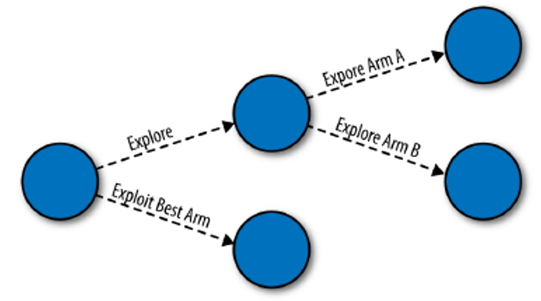

# Введение в Эпсилон-жадный алгоритм

В компьютерной науке жадный алгоритм - это алгоритм, который всегда принимает то решение, которое кажется наилучшим в данный момент, даже если это решение может привести к плохим долгосрочным последствиям. 

Эпсилон-жадный алгоритм - это почти жадный алгоритм, потому что он обычно использует наилучший доступный вариант, но время от времени эпсилон-жадный алгоритм исследует и другие доступные варианты. Как мы увидим, термин "эпсилон" в названии алгоритма относится к попыткам, когда алгоритм исследует, а не эксплуатирует.

Интуиция алгоритма **Epsilon-Greedy** очень проста: если вы подбрасываете монету и она выпадает орлом, вам следует немного исследовать. Но если монета выпала решкой, нужно эксплуатировать.

- Предположим, что разработчик выбирает между двумя цветами, зеленым и красным, и хочет найти тот цвет, который максимизирует вероятность того, что новый посетитель сайта зарегестрируется на сайте. 
- Алгоритм **Epsilon-Greedy** пытается найти наилучший цветовой логотип с помощью следующей процедуры (схематично показанной на рисунке), которая последовательно применяется к каждому новому потенциальному клиенту:

**Замечание.** Здесь рассматриваются 2 руки == 2 варианта логотипа: зеленый и красный.

- Когда на сайт заходит новый посетитель, алгоритм подбрасывает монетку, которая с вероятностью **эпсилон** выпадает решкой. 
- Если монета выпала орлом, алгоритм будет использовать лучшую руку (эксплуатировать). Для этого алгоритм просматривает исторические показатели конверсии для зеленого и красного логотипов в любом источнике данных, который он использует для отслеживания ситуации. Определив, какой цвет имел наибольший коэффициент успешности в прошлом, алгоритм решает показать новому посетителю тот цвет, который был наиболее успешным в прошлом.
- Если вместо орла монета выпадает решкой, алгоритм переходит к исследованию. Поскольку исследование предполагает случайное экспериментирование с двумя рассматриваемыми цветами, алгоритму необходимо подбросить вторую монету, чтобы выбрать один из них. В отличие от первой монеты, мы предположим, что вторая монета выпадает орлом в 50 % случаев. После того как вторая монета подброшена, алгоритм может перейти к последнему шагу процедуры:
    - Если вторая монета выпадает орлом, покажите новому посетителю зеленый логотип. 
    - Если вторая монета выпадает решкой, покажите новому посетителю красный логотип.

Если дать этому алгоритму поработать с посетителями сайта в течение длительного времени, вы увидите, что он работает, колеблясь между 
- (А) использованием лучшего варианта, о котором он знает в данный момент, 
- и (Б) случайным поиском среди всех доступных ему вариантов. 

Фактически, из определения алгоритма вы знаете, что:

- С вероятностью 1 - epsilon алгоритм **Epsilon-Greedy** использует лучший из известных вариантов; 
- С вероятностью epsilon / 2 алгоритм **Epsilon-Greedy** исследует лучший из известных вариантов; 
- С вероятностью epsilon / 2 алгоритм **Epsilon-Greedy** исследует худший из известных вариантов.