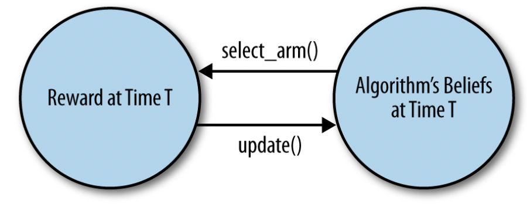

# Тестирующий фреймворк - введение

Несмотря на то, что в ранее была приведена полная реализация алгоритма epsilon-Greedy, это все равно было очень абстрактное обсуждение, поскольку алгоритм так и не был запущен. Причина этого проста: в отличие от стандартных инструментов машинного обучения, алгоритмы бандитов - это не просто функции "черного ящика", которые можно вызвать для обработки имеющихся у вас данных, - алгоритмы бандитов должны активно выбирать, какие данные следует получить, и анализировать их в режиме реального времени. 

Действительно, алгоритмы бандитов являются примером двух типов обучения, которые отсутствуют в стандартных примерах ML: активного обучения, которое относится к алгоритмам, активно выбирающим данные, которые они должны получить; и онлайн-обучения, которое относится к алгоритмам, анализирующим данные в режиме реального времени и предоставляющим результаты на лету.

Это означает, что в каждом бандитском алгоритме существует сложный цикл обратной связи: как показано на рисунке, поведение алгоритма зависит от данных, которые он видит, а данные, которые видит алгоритм, зависят от поведения алгоритма. Поэтому отладка бандитского алгоритма значительно сложнее, чем отладка обычного алгоритма машинного обучения, который не занимается активным обучением. Вы не можете просто скормить алгоритму-бандиту данные: вам нужно где-то запустить его, чтобы посмотреть, как он может вести себя в производстве. 

Конечно, делать это на собственном сайте может быть очень рискованно: вы же не хотите выкладывать непроверенный код на живой сайт.

Чтобы решить обе эти проблемы, мы воспользуемся альтернативой стандартному юнит-тестированию, которая подходит для тестирования бандитских алгоритмов. Эта альтернатива называется симуляцией Монте-Карло. Название пошло со времен Второй мировой войны, когда ученые проверяли, как может повести себя оружие и другие системы, используя простые компьютеры, оснащенные генератором случайных чисел.

Для наших целей симуляция Монте-Карло позволит нашей реализации алгоритма бандита активно принимать решения о том, какие данные ей получать, поскольку наши симуляции смогут предоставлять алгоритму для анализа симулированные данные в режиме реального времени. Короче говоря, мы будем работать с циклом обратной связи, показанным ранее, кодируя как наш алгоритм бандита, так и симуляцию рук бандита, между которыми алгоритм должен выбирать. Затем эти две части кода работают вместе, чтобы создать пример того, как алгоритм может функционировать в реальности.

Поскольку в каждой симуляции используются случайные числа, результаты получаются шумными. По этой причине вам потребуется провести множество симуляций. К счастью, современные компьютеры, в отличие от тех, что использовались во время Второй мировой войны, вполне справляются с этой задачей. Как вы увидите через некоторое время, мы можем легко смоделировать 100 000 запусков алгоритма бандита, чтобы развить интуицию относительно его поведения в различных условиях. Это, пожалуй, гораздо важнее, чем понимание конкретного алгоритма бандита.